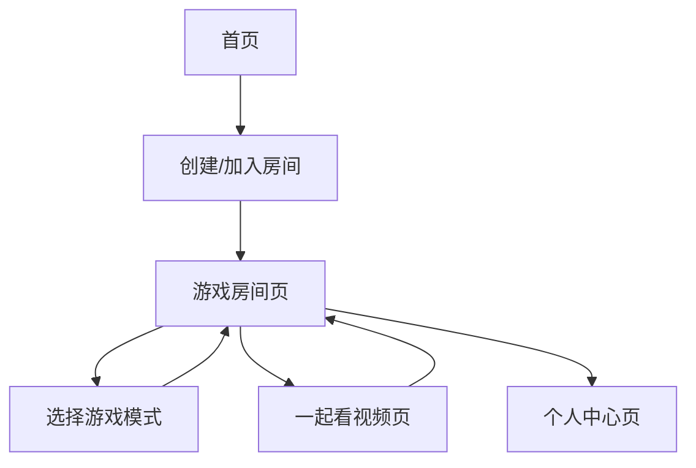

# P2P异地情侣小游戏产品需求文档

## 1. 产品概述
一款专为异地情侣设计的P2P实时互动小游戏平台，通过WebRTC技术实现高质量的音视频通信和多种趣味游戏模式。
- 解决异地情侣缺乏互动娱乐方式的问题，提供沉浸式的共同体验
- 目标用户：18-35岁的异地恋情侣群体
- 市场价值：填补异地恋娱乐社交的细分市场空白

## 2. 核心功能

### 2.1 用户角色
| 角色 | 注册方式 | 核心权限 |
|------|----------|----------|
| 普通用户 | 手机号/邮箱注册 | 可创建/加入房间，使用基础游戏功能 |
| 会员用户 | 付费升级 | 解锁高级游戏模式，无限制使用时长 |

### 2.2 功能模块
我们的异地情侣小游戏包含以下主要页面：
1. **首页**：用户登录、房间创建/加入、功能导航
2. **游戏房间页**：音视频通话、游戏选择、实时互动
3. **一起看视频页**：同步视频播放、弹幕互动
4. **个人中心页**：用户信息、游戏记录、设置

### 2.3 页面详情
| 页面名称 | 模块名称 | 功能描述 |
|----------|----------|----------|
| 首页 | 登录模块 | 用户注册登录、快速匹配、创建房间 |
| 首页 | 房间列表 | 显示可加入的房间、房间状态管理 |
| 游戏房间页 | 音视频通话 | WebRTC实时音视频通信、画质调节、静音控制 |
| 游戏房间页 | 游戏选择器 | 多种小游戏选择：你画我猜、真心话大冒险、情侣问答 |
| 游戏房间页 | 实时互动 | 文字聊天、表情包、虚拟礼物 |
| 一起看视频页 | 视频同步播放 | 支持多平台视频链接、同步播放控制、进度同步 |
| 一起看视频页 | 弹幕系统 | 实时弹幕评论、表情反应 |
| 个人中心页 | 用户信息 | 个人资料编辑、头像上传、情侣绑定 |
| 个人中心页 | 游戏记录 | 历史游戏记录、成就系统、亲密度统计 |

## 3. 核心流程

**用户使用流程：**
用户注册登录后，可以创建或加入游戏房间。在房间内，双方建立音视频连接，选择喜欢的小游戏进行互动。也可以切换到一起看视频模式，同步观看在线视频内容。

**管理员流程：**
管理员可以监控房间状态，管理用户行为，维护游戏内容和处理用户反馈。

## 4. 用户界面设计

### 4.1 设计风格
- 主色调：温馨粉色(#FF69B4)和浪漫紫色(#9370DB)
- 按钮样式：圆角设计，渐变色彩，3D悬浮效果
- 字体：苹方字体，标题18px，正文14px
- 布局风格：卡片式设计，顶部导航，响应式布局
- 图标风格：可爱卡通风格，情侣主题emoji表情

### 4.2 页面设计概览
| 页面名称 | 模块名称 | UI元素 |
|----------|----------|--------|
| 首页 | 登录模块 | 渐变背景，圆形头像框，粉色登录按钮，爱心装饰动画 |
| 游戏房间页 | 音视频通话 | 分屏视频窗口，悬浮控制按钮，音量可视化波形 |
| 游戏房间页 | 游戏选择器 | 卡片式游戏图标，hover动画效果，游戏难度标识 |
| 一起看视频页 | 视频播放器 | 自定义播放器UI，同步状态指示器，弹幕滚动区域 |
| 个人中心页 | 用户信息 | 圆形头像，渐变信息卡片，编辑按钮，情侣绑定状态 |

### 4.3 响应式设计
产品采用移动端优先的响应式设计，支持手机、平板和桌面端访问，针对触屏操作进行优化，确保在不同设备上都有良好的用户体验。