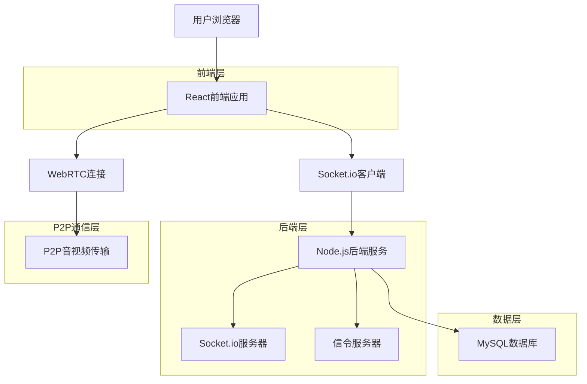
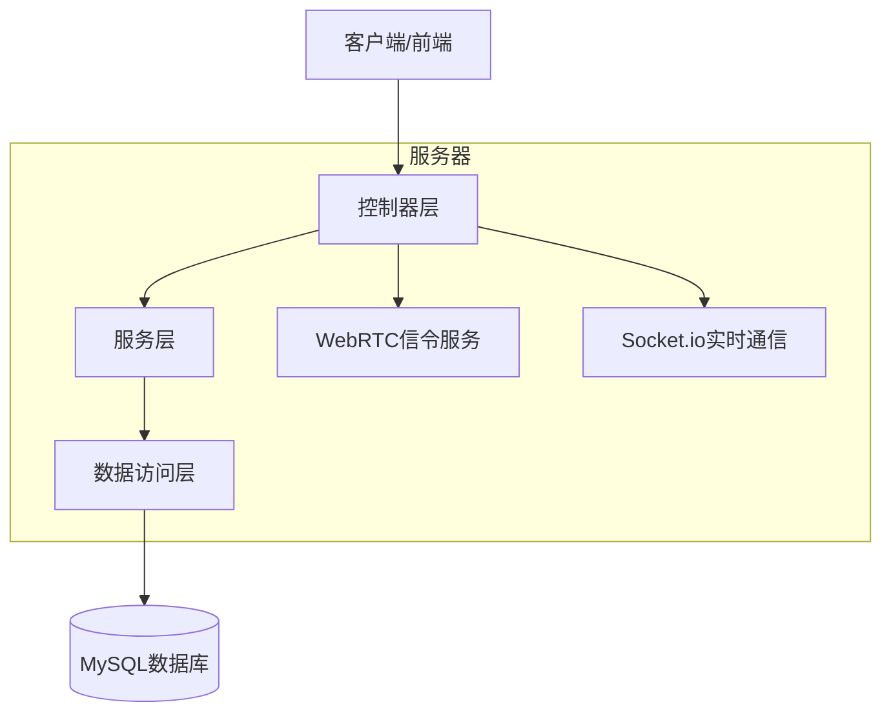
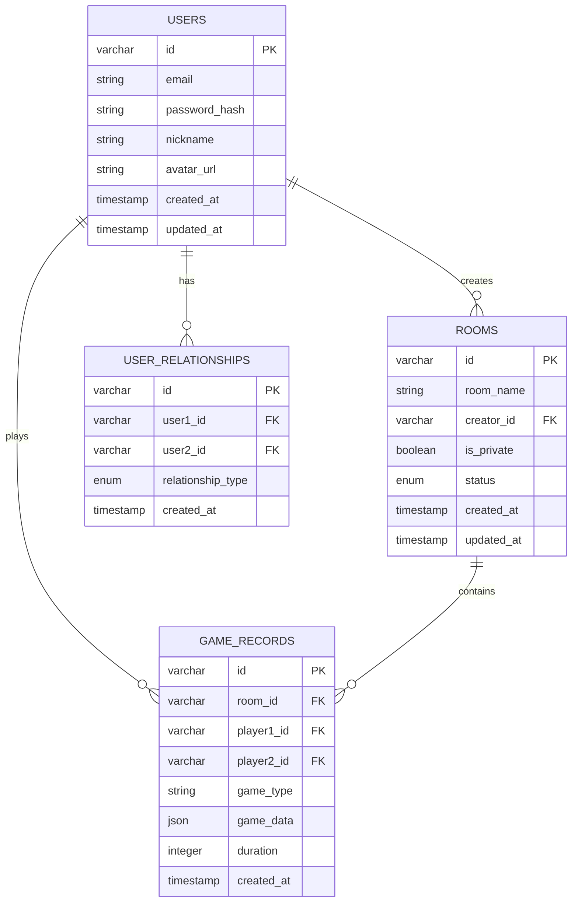

# P2P异地情侣小游戏技术架构文档

## 1. 架构设计



## 2. 技术描述

* 前端：React\@18 + TypeScript + Tailwind CSS + Vite

* 后端：Node.js + Express + Socket.io + WebRTC信令服务

* 数据库：MySQL + mysql2

* 实时通信：WebRTC + Socket.io

* 部署：Vercel (前端) + Railway (后端)

## 3. 路由定义

| 路由             | 用途               |
| -------------- | ---------------- |
| /              | 首页，用户登录和房间管理     |
| /room/:roomId  | 游戏房间页，音视频通话和游戏互动 |
| /watch/:roomId | 一起看视频页，同步视频播放    |
| /profile       | 个人中心页，用户信息和设置    |
| /login         | 登录页面，用户认证        |
| /register      | 注册页面，新用户注册       |

## 4. API定义

### 4.1 核心API

用户认证相关

```
POST /api/auth/login
```

请求参数：

| 参数名      | 参数类型   | 是否必需 | 描述   |
| -------- | ------ | ---- | ---- |
| email    | string | true | 用户邮箱 |
| password | string | true | 用户密码 |

响应参数：

| 参数名     | 参数类型    | 描述      |
| ------- | ------- | ------- |
| success | boolean | 登录是否成功  |
| token   | string  | JWT认证令牌 |
| user    | object  | 用户信息对象  |

房间管理相关

```
POST /api/rooms/create
```

请求参数：

| 参数名       | 参数类型    | 是否必需  | 描述     |
| --------- | ------- | ----- | ------ |
| roomName  | string  | true  | 房间名称   |
| isPrivate | boolean | false | 是否私密房间 |

WebRTC信令相关

```
POST /api/webrtc/offer
POST /api/webrtc/answer
POST /api/webrtc/ice-candidate
```

## 5. 服务器架构图



## 6. 数据模型

### 6.1 数据模型定义



### 6.2 数据定义语言

用户表 (users)

```sql
-- 创建用户表
CREATE TABLE users (
    id VARCHAR(36) PRIMARY KEY DEFAULT (UUID()),
    email VARCHAR(255) UNIQUE NOT NULL,
    password_hash VARCHAR(255) NOT NULL,
    nickname VARCHAR(100) NOT NULL,
    avatar_url TEXT,
    created_at TIMESTAMP DEFAULT CURRENT_TIMESTAMP,
    updated_at TIMESTAMP DEFAULT CURRENT_TIMESTAMP ON UPDATE CURRENT_TIMESTAMP
);

-- 创建索引
CREATE INDEX idx_users_email ON users(email);
CREATE INDEX idx_users_created_at ON users(created_at DESC);
```

房间表 (rooms)

```sql
-- 创建房间表
CREATE TABLE rooms (
    id VARCHAR(36) PRIMARY KEY DEFAULT (UUID()),
    room_name VARCHAR(255) NOT NULL,
    creator_id VARCHAR(36),
    is_private BOOLEAN DEFAULT false,
    status ENUM('active', 'inactive', 'closed') DEFAULT 'active',
    created_at TIMESTAMP DEFAULT CURRENT_TIMESTAMP,
    updated_at TIMESTAMP DEFAULT CURRENT_TIMESTAMP ON UPDATE CURRENT_TIMESTAMP,
    FOREIGN KEY (creator_id) REFERENCES users(id)
);

-- 创建索引
CREATE INDEX idx_rooms_creator_id ON rooms(creator_id);
CREATE INDEX idx_rooms_status ON rooms(status);
CREATE INDEX idx_rooms_created_at ON rooms(created_at DESC);
```

游戏记录表 (game\_records)

```sql
-- 创建游戏记录表
CREATE TABLE game_records (
    id VARCHAR(36) PRIMARY KEY DEFAULT (UUID()),
    room_id VARCHAR(36),
    player1_id VARCHAR(36),
    player2_id VARCHAR(36),
    game_type VARCHAR(50) NOT NULL,
    game_data JSON,
    duration INTEGER DEFAULT 0,
    created_at TIMESTAMP DEFAULT CURRENT_TIMESTAMP,
    FOREIGN KEY (room_id) REFERENCES rooms(id),
    FOREIGN KEY (player1_id) REFERENCES users(id),
    FOREIGN KEY (player2_id) REFERENCES users(id)
);

-- 创建索引
CREATE INDEX idx_game_records_room_id ON game_records(room_id);
CREATE INDEX idx_game_records_player1_id ON game_records(player1_id);
CREATE INDEX idx_game_records_player2_id ON game_records(player2_id);
CREATE INDEX idx_game_records_created_at ON game_records(created_at DESC);
```

用户关系表 (user\_relationships)

```sql
-- 创建用户关系表
CREATE TABLE user_relationships (
    id VARCHAR(36) PRIMARY KEY DEFAULT (UUID()),
    user1_id VARCHAR(36),
    user2_id VARCHAR(36),
    relationship_type ENUM('couple', 'friend') DEFAULT 'couple',
    created_at TIMESTAMP DEFAULT CURRENT_TIMESTAMP,
    FOREIGN KEY (user1_id) REFERENCES users(id),
    FOREIGN KEY (user2_id) REFERENCES users(id)
);

-- 创建索引
CREATE INDEX idx_user_relationships_user1_id ON user_relationships(user1_id);
CREATE INDEX idx_user_relationships_user2_id ON user_relationships(user2_id);

-- 初始化数据
INSERT INTO users (email, password_hash, nickname) VALUES 
('demo1@example.com', '$2b$10$example_hash_1', '小明'),
('demo2@example.com', '$2b$10$example_hash_2', '小红');
```

